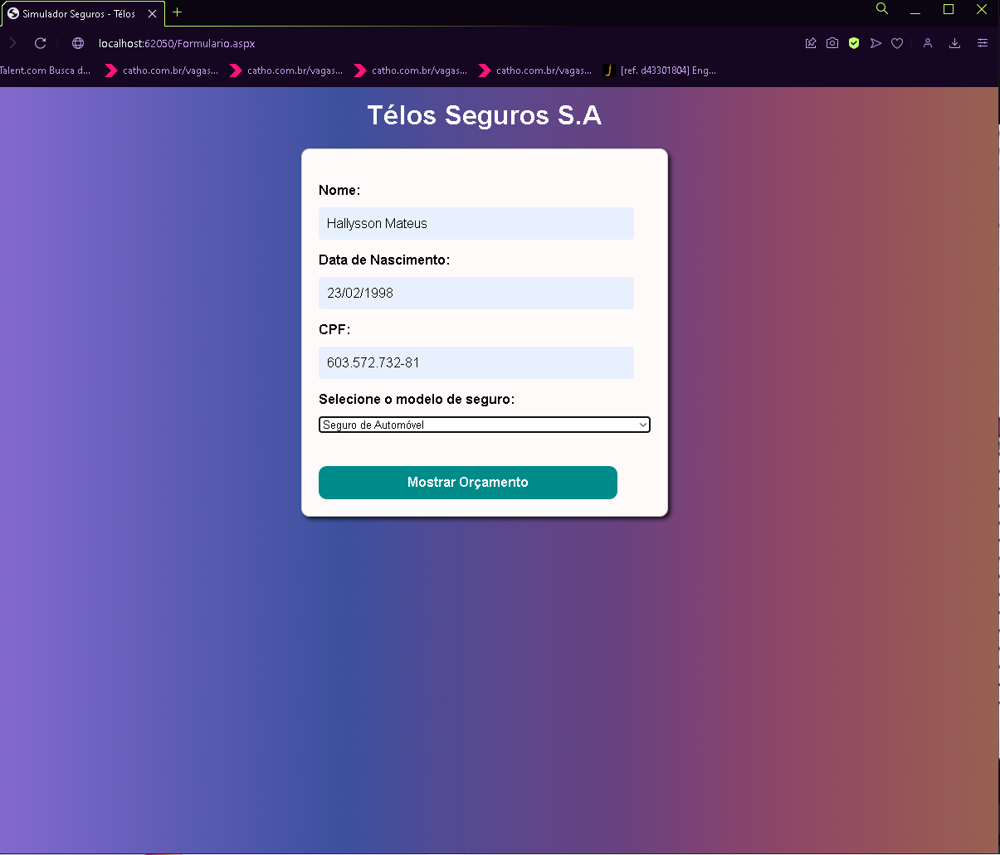
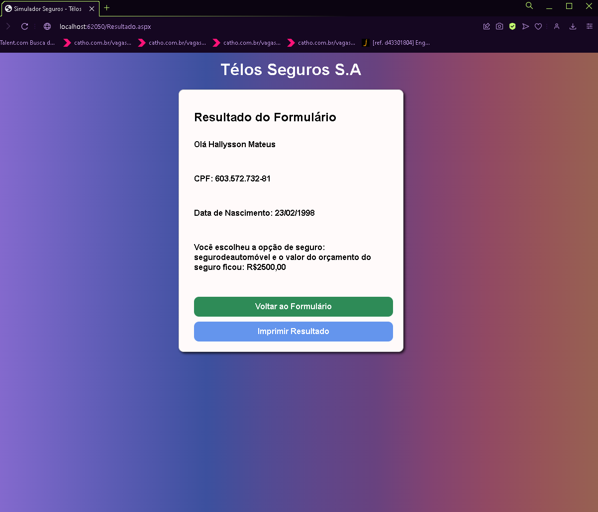

# Simulador de Seguros Web

## Introdução ao .NET Framework

Sejam muito bem-vindos! O objetivo deste projeto é criar um simulador de seguros web básico utilizando **.NET Framework 4.8** e **Web Forms**. A aplicação permite ao usuário inserir seus dados pessoais, escolher um tipo de seguro, e exibe um valor estimado para o seguro selecionado. Este projeto visa aplicar conceitos de programação web e criar uma interface intuitiva para o usuário.

## Formulário



## Resultado

E aqui está o resultado da simulação:



## Funcionalidades Implementadas

### 1. Página Mestra
- **Descrição:** A página mestra define o layout padrão da aplicação.
- **Funcionalidades:**
  - Contém o cabeçalho, rodapé e menu de navegação.
  - Utiliza placeholders para inserção do conteúdo das páginas internas.
  
### 2. Página de Formulário
- **Descrição:** Permite ao usuário inserir seus dados pessoais e escolher um tipo de seguro.
- **Funcionalidades:**
  - Campos para nome, data de nascimento e CPF.
  - Seleção do tipo de seguro via lista dropdown.
  - Validação dos campos (nome, CPF, e data de nascimento) antes do envio.
  - Tipos de seguro disponíveis:
    - Seguro de vida
    - Seguro de morte acidental
    - Seguro contra acidentes pessoais
    - Seguro de saúde
    - Seguro de automóvel
    - Seguro residencial
    - Seguro patrimonial
    - Seguro empresarial

### 3. Página de Resultado
- **Descrição:** Exibe o resultado do cálculo do seguro com os dados fornecidos pelo usuário.
- **Funcionalidades:**
  - Exibe o nome, data de nascimento, CPF, tipo de seguro e o valor calculado.
  - Opção para retornar à página de formulário.
  - Botão para imprimir o resultado (opcional).
  - Formatação do valor usando `CultureInfo` para exibir a moeda correta.

### 4. Implementação do Cálculo do Seguro
- **Descrição:** Calcula o valor estimado do seguro com base nas informações inseridas.
- **Funcionalidades:**
  - O cálculo baseia-se na idade do usuário e no tipo de seguro selecionado.
  - Todos os seguros partem de um valor anual base de R$ 1.000,00.
  - Cada tipo de seguro possui um valor percentual definido, por exemplo:
    - Seguro de vida: 80% do valor anual (R$ 800,00).

### 5. Validação dos Dados (Extra)
- **Descrição:** Implementação de validações nos campos do formulário.
- **Funcionalidades:**
  - Validação de campos obrigatórios.
  - Validação do formato do CPF (usando expressões regulares).
  - Validação da data de nascimento (usuário deve ter mais de 18 anos).
  - Exibição de mensagens de erro claras e concisas para o usuário.

## Como Executar o Projeto

1. Clone este repositório:  
   ```bash
   git clone https://github.com/seuusuario/Simulator-Nivel4.git

2. Abra o projeto no Visual Studio.

3. Execute o projeto localmente utilizando o IIS Express

## Tecnologias Utilizadas
- **.NET Framework 4.8**

- **ASP.NET Web Forms**

- **C#**

- **HTML/CSS**
